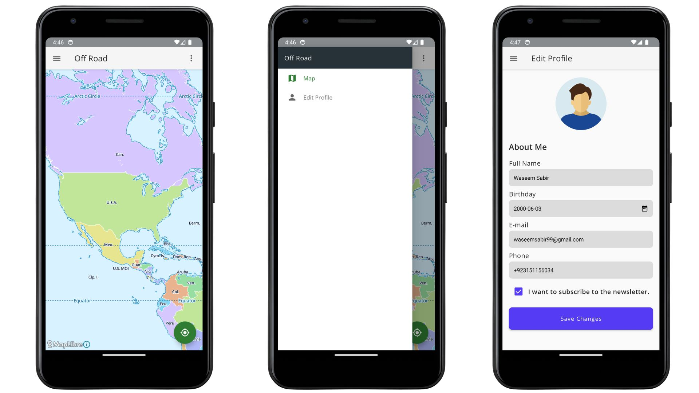

# Off-Road

Simple application that showcases best principles and practices for Android development.

Below are few things included in this project:
*   UI built with **Jetpack Compose** 
*   Uses single activity **Navigation Compose** for navigation
*   Compose presentation layer with  **ViewModel** per screen.
*   UI Reactivity using **Flow** and **coroutines** for async operations.
*   A **data layer** with a repository and network data source.
*   Dependency injection using **Hilt**.
*   Maps with **Maplibre SDK**.
*   Location and other permission management with **Accompanist Permission**

## Screenshots

